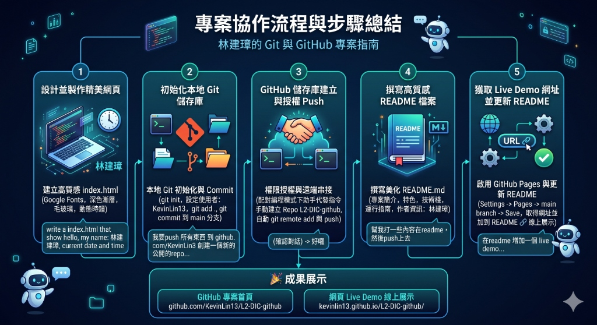

# 📝 專案開發與 GitHub 協作工作報告 (Work Report)

本報告記錄了「林建璋個人網頁」的開發、Git 初始化、GitHub 遠端推送授權以及 GitHub Pages (Live Demo) 串接的完整流程。

---

## 🎨 專案流程視覺化圖表
下圖為本次專案協作的完整 5 大步驟路線圖：



---

## 🛠️ 任務階段與執行細節

### 1️⃣ 設計並製作精美個人首頁
- **任務描述**：根據用戶名「林建璋」製作一個精美且具備動態即時時間顯示的 `index.html` 網頁。
- **技術實現**：
  - **佈局與美學**：採用前衛的 **Glassmorphism (毛玻璃質感)** 卡片主體與深邃靛藍漸層背景。
  - **背景特效**：配置兩個以 CSS Keyframes 動態控制的漂浮流體光暈（Ambient Blobs），營造高端科技感。
  - **字型優化**：引入 Google Fonts 中的 *Outfit* (英文) 與 *Noto Sans TC* (中文) 以確保跨裝置排版一致性。
  - **動態更新**：採用 Vanilla JS 建立 `setInterval` 定時器，每秒抓取本地時間並轉換為對齊的中文字元。

---

### 2️⃣ 本地 Git 儲存庫初始化
- **任務描述**：將本地端資料夾 `L2 DIC=github` 轉換為 Git 儲存庫並提交程式碼。
- **技術實現**：
  - 在本機目錄初始化 Git 儲存庫 (`git init`)。
  - 將專案提交者資訊設定為 `KevinLin13` 並對齊用戶 GitHub 帳號。
  - 成功將 `index.html` 提交至 `main` 分支。

---

### 3️⃣ GitHub 遠端儲存庫串接與安全授權
- **任務描述**：安全地將本地端代碼推送至 GitHub.com 上的新公開 Repository `L2-DIC-github`。
- **技術實現**：
  - **協作授權模式**：用戶授權 AI 助手直接於本地終端機下達指令，並由本機的 **Git Credential Manager**（Windows 憑證管理器）彈出安全認證，保障帳戶隱私安全。
  - **遠端關聯與 Push**：
    ```bash
    git remote add origin https://github.com/KevinLin13/L2-DIC-github.git
    git push -u origin main
    ```

---

### 4️⃣ 建立與編寫高質感 README 說明文件
- **任務描述**：為儲存庫編寫專業的 README.md 說明文件。
- **技術實現**：
  - 建立富文本 `README.md`，結構化地列出專案特色（Features）、技術棧（Tech Stack）、快速啟用指南（Quick Start）以及作者資訊。
  - 完成編寫後，自動提交並 Push 到 GitHub。

---

### 5️⃣ 啟用 GitHub Pages 與新增 Live Demo 連結
- **任務描述**：啟用靜態頁面託管並將 Live Demo 網址更新回 README 之中。
- **技術實現**：
  - **GitHub Pages 配置**：於 GitHub 專案 Settings ➡️ Pages ➡️ 將 Branch 設為 `main` 分支並啟用部署。
  - **獲取網址**：從 Deployments ➡️ `github-pages` 取得 Live Demo 網址：`https://kevinlin13.github.io/L2-DIC-github/`。
  - **README 更新**：於 README 最上方區塊加入直觀的「🔗 線上展示 (Live Demo)」按鈕，並重新 Push 完成同步。

---

## 🔗 成果網址彙整
* **GitHub 專案首頁**：[https://github.com/KevinLin13/L2-DIC-github](https://github.com/KevinLin13/L2-DIC-github)
* **網頁 Live Demo 線上展示**：[https://kevinlin13.github.io/L2-DIC-github/](https://kevinlin13.github.io/L2-DIC-github/)
